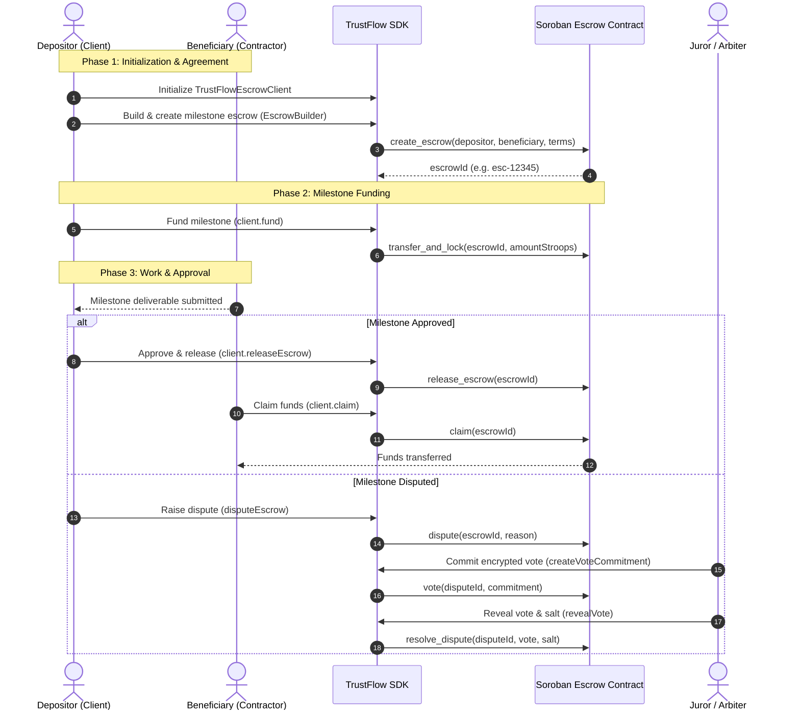

# Multi-Party Milestone Escrow Lifecycle Tutorial

This guide walks you through the complete lifecycle of a multi-party milestone escrow using the TrustFlow SDK: from client initialization and milestone creation to funding, milestone approval, fund release, and dispute resolution with juror commit-reveal voting.

---

## Architecture Overview



---

## Prerequisites & Installation

Install `@trustflow/sdk` and `@stellar/stellar-sdk`:

```bash
npm install @trustflow/sdk @stellar/stellar-sdk
```

Ensure your environment defines the target Stellar network and deployed TrustFlow contract ID:

```typescript
import type { ContractConfig } from '@trustflow/sdk';

export const config: ContractConfig = {
  contractId: process.env.TRUSTFLOW_CONTRACT_ID || 'CAAAAAAAAAAAAAAAAAAAAAAAAAAAAAAAAAAAAAAAAAAAAAAAAAAABSC4',
  network: 'TESTNET',
  rpcUrl: process.env.SOROBAN_RPC_URL || 'https://soroban-testnet.stellar.org',
  networkPassphrase: 'Test SDF Network ; September 2015',
  timeoutMs: 15_000,
};
```

---

## Step 1: Client Initialization

Initialize `TrustFlowEscrowClient` for escrow management and `TrustFlowClient` for general Soroban interactions:

```typescript
import { TrustFlowEscrowClient, TrustFlowClient } from '@trustflow/sdk';
import { config } from './config';

// Primary escrow operations client
const escrowClient = new TrustFlowEscrowClient(config, {
  timeoutMs: 15_000,
  retry: { attempts: 3, baseDelayMs: 500, maxDelayMs: 3_000 },
});

// General Soroban & account client
const stellarClient = new TrustFlowClient(config);
```

---

## Step 2: Milestone Escrow Creation

Construct an immutable escrow definition using `EscrowBuilder`:

```typescript
import { EscrowBuilder } from '@trustflow/sdk';

// 1. Build the escrow definition
const escrowParams = new EscrowBuilder()
  .setDepositor('GDEPOSITOR_STELLAR_PUBLIC_KEY_HERE_EXAMPLE_ACCOUNT')
  .setBeneficiary('GBENEFICIARY_STELLAR_PUBLIC_KEY_HERE_EXAMPLE_ACC')
  .setAmount('150.00') // 150 XLM
  .setDeadline(100_000) // Deadline in ledger blocks
  .build();

// 2. Submit escrow creation to the contract
const createResult = await escrowClient.createEscrow(escrowParams);

if (!createResult.ok) {
  throw new Error(`Failed to create escrow: ${createResult.error}`);
}

const escrowId = createResult.data.escrowId;
console.log(`Milestone Escrow Created! ID: ${escrowId}`);
console.log(`Transaction Hash: ${createResult.data.txHash}`);
```

---

## Step 3: Milestone Funding

Lock funds into the smart contract for the specific milestone:

```typescript
import { xlmToStroops } from '@trustflow/sdk';

const depositorAddress = 'GDEPOSITOR_STELLAR_PUBLIC_KEY_HERE_EXAMPLE_ACCOUNT';
const milestoneAmountStroops = xlmToStroops('150.00'); // 1_500_000_000n

// Lock funds into the escrow
const fundResult = await escrowClient.fund(
  escrowId,
  depositorAddress,
  milestoneAmountStroops,
  // Optional: pass Soroban token contract ID for USDC / stablecoins
  // 'CUSDC_CONTRACT_ADDRESS_HERE'
);

if (!fundResult.ok) {
  throw new Error(`Funding failed: ${fundResult.error}`);
}

console.log(`Milestone funded! Tx: ${fundResult.data.txHash}`);
```

---

## Step 4: Milestone Delivery & Approval

When the beneficiary delivers the work and the depositor verifies it, the escrow can be released or claimed:

### Option A: Depositor Releases Funds
```typescript
const depositorAddress = 'GDEPOSITOR_STELLAR_PUBLIC_KEY_HERE_EXAMPLE_ACCOUNT';

const releaseResult = await escrowClient.releaseEscrow(escrowId, depositorAddress);
if (!releaseResult.ok) {
  throw new Error(`Release failed: ${releaseResult.error}`);
}

console.log(`Milestone funds released! Tx: ${releaseResult.data.txHash}`);
```

### Option B: Beneficiary Claims Cleared Funds
```typescript
const beneficiaryAddress = 'GBENEFICIARY_STELLAR_PUBLIC_KEY_HERE_EXAMPLE_ACC';

const claimResult = await escrowClient.claim(escrowId, beneficiaryAddress);
if (!claimResult.ok) {
  throw new Error(`Claim failed: ${claimResult.error}`);
}

console.log(`Milestone funds claimed! Tx: ${claimResult.data.txHash}`);
```

---

## Step 5: Dispute Resolution with Commit-Reveal Voting

If deliverables fail specifications or terms are breached, either party can escalate to dispute resolution.

### 1. Raising an On-Chain Dispute
```typescript
import { disputeEscrow } from '@trustflow/sdk';

try {
  const disputeTx = await disputeEscrow(stellarClient, {
    escrowId,
    caller: 'GDEPOSITOR_STELLAR_PUBLIC_KEY_HERE_EXAMPLE_ACCOUNT',
    reason: 'Deliverables failed acceptance tests outlined in agreement',
  });
  console.log(`Dispute raised on-chain: ${disputeTx}`);
} catch (error) {
  console.error('Failed to raise dispute:', error);
}
```

### 2. Juror Commit-Reveal Voting
To prevent front-running and herd mentality, jurors cast hidden commitments during the voting period and reveal them once voting closes.

```typescript
import { JurorClient } from '@trustflow/sdk';

const jurorClient = new JurorClient(config);
const jurorAddress = 'GJUROR_STELLAR_PUBLIC_KEY_HERE_EXAMPLE_ACCOUNT';

// Phase 1: Juror generates commitment and commits vote
// true = vote for depositor; false = vote for beneficiary
const commitment = jurorClient.createVoteCommitment(true);

const commitVoteResult = await jurorClient.vote({
  disputeId: escrowId,
  jurorAddress,
  vote: {
    encrypted: true,
    ciphertext: commitment.ciphertext, // Base64 SHA-256(vote_byte ++ salt)
  },
});

if (!commitVoteResult.ok) {
  throw new Error(`Commitment vote failed: ${commitVoteResult.error}`);
}

console.log('Vote committed! Salt securely retained for reveal phase.');

// Phase 2: Reveal phase (after commit window closes)
const storedSalt = jurorClient.getStoredSalt(commitment.commitmentHex);
if (!storedSalt) {
  throw new Error('Secret salt not found in local store');
}

const revealData = jurorClient.revealVote(true, storedSalt);
console.log('Revealed vote verified matching commitment hash:', revealData.commitmentHex);
```

---

## Error Handling & Recovery Strategies

The TrustFlow SDK surfaces errors via `TrustFlowError` and result objects (`SDKResult<T>`).

### Transient vs Fatal Errors

```typescript
import { TrustFlowError } from '@trustflow/sdk';

try {
  const res = await escrowClient.fund(escrowId, depositorAddress, milestoneAmountStroops);
  if (!res.ok) {
    console.error('Operational failure:', res.error);
  }
} catch (err) {
  if (err instanceof TrustFlowError) {
    switch (err.code) {
      // Transient errors: safe to retry with backoff
      case 'TIMEOUT':
      case 'CONNECTION_ERROR':
      case 'NETWORK_ERROR':
        console.warn(`Transient network issue (${err.code}). Retrying...`);
        break;

      // Fatal errors: requires user or code intervention
      case 'VALIDATION_ERROR':
        console.error(`Invalid input on field ${err.field}:`, err.message);
        break;
      case 'UNAUTHORIZED':
        console.error('Caller not authorized to perform action:', err.message);
        break;
      case 'SIMULATION_ERROR':
        console.error('Contract simulation rejected:', err.message);
        break;
      default:
        console.error(`Unexpected SDK Error [${err.code}]:`, err.message);
    }
  } else {
    console.error('Unexpected runtime error:', err);
  }
}
```

### Best Practices

1. **Stroop Precision**: Always use `xlmToStroops` or integer BigInt values for contract amounts. 1 XLM = 10,000,000 stroops (`10^7`).
2. **Offline Testing**: Utilize `createMockSorobanServer` and `createMockHorizonServer` from `@trustflow/sdk/testing` for rapid local testing without spinning up a Stellar quickstart node.
3. **Commitment Security**: Keep salts stored securely during commit phases; lost salts cannot be recovered to verify juror votes.
